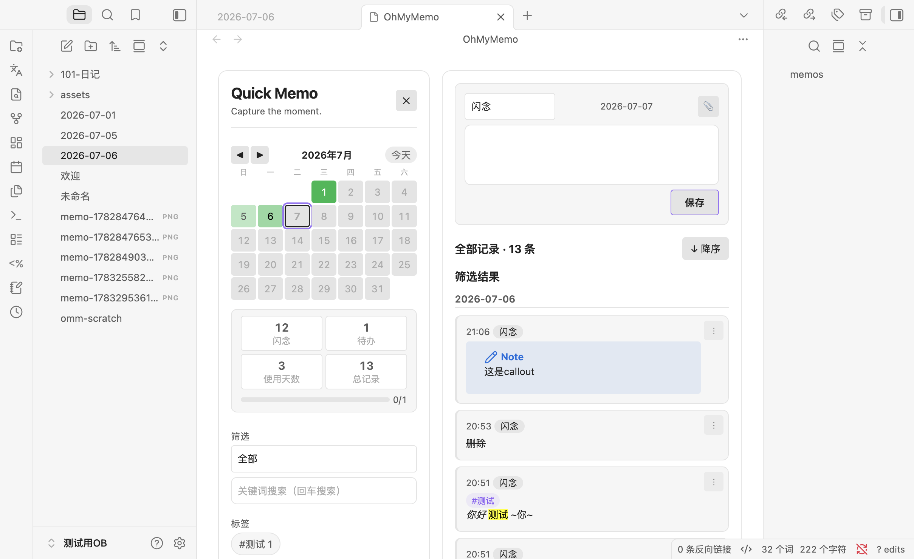

# OhMyMemo

一个 Markdown 原生的 Obsidian 快速记录插件。不依赖数据库，记录直接写入你的日记文件——你的 `.md` 文件就是唯一数据源。



## 为什么做这个

在 Obsidian 里实现类 flomo 的快速捕获体验。记录直接写入日记文件的 Markdown 列表，不依赖数据库，用任何编辑器都能直接看、直接改。插件只负责读写指定标题下的区域，维护一个可随时重建的内存索引来支撑搜索、筛选和热力图。

## 安装

### 从 GitHub Release 安装

1. 到 [Releases 页面](https://github.com/dangehub/obsidian-oh-my-memo/releases) 下载最新版的 `main.js`、`manifest.json`、`styles.css` 三个文件
2. 在你的 vault 里创建文件夹 `.obsidian/plugins/oh-my-memo/`
3. 把三个文件放进去
4. Obsidian → 设置 → 第三方插件 → 关闭安全模式 → 启用 **OhMyMemo**

### 从源码构建

```bash
npm install
npm run build
```

把生成的 `main.js`、`manifest.json`、`styles.css` 复制到插件目录即可。

## 用法

点左侧栏的笔记本图标，或用命令面板执行 `OhMyMemo: Open overview` 打开主面板。面板在主内容区以标签页打开，和普通笔记一样。

**记录流程：** 输入区选类型（闪念/待办）→ 写 Markdown → `Cmd/Ctrl+Enter` 或点保存 → 内容写入当天日记文件的指定标题下，列表即时刷新。

**编辑器：** 使用 Obsidian 原生 Markdown 编辑器（Live Preview），自动继承你安装的所有编辑器扩展（如 easy-typing），不需要额外配置。支持粘贴图片附件，链接格式跟随 Obsidian 全局设置。

**浏览记录：** 默认显示全部记录，按日期分组。点日历某天切到单日视图，点「显示全部」回去。热力图展示活动趋势，点击日期跳转。

**卡片操作：** 每条记录右上角 `⋮` 菜单 → 编辑 / 复制块链接 / 打开源文件 / 删除。待办直接点勾选框切换状态，自动回写文件。

**筛选：** 按类型、标签、关键词筛选。搜索回车触发，不打断中文输入法。

**移动端：** 侧边栏变为从左侧滑入的抽屉，顶部有导航栏，图片支持灯箱缩放。

## 设置

| 设置项 | 说明 |
|---|---|
| Memos 标题 | 插件读写的标题，默认 `### memos`，支持任意层级 |
| 写入位置 | 新记录插入位置：标题下 / 日记末尾 |
| 处理范围 | 扫描范围：仅标题内 / 整篇日记（兼容历史数据中标题不一致的情况） |
| 自定义日记路径 | 开启后按指定文件夹和日期格式定位日记文件 |
| 启用块 ID | 开启后每条记录带 `^omm-` 块 ID，支撑编辑/删除/勾选/块链接；关闭则进入纯 Markdown 模式 |
| 附件存放路径 | 五种模式：遵循 Obsidian 设置 / vault 根目录 / 同目录 / 子目录 / 自定义 |
| 链接语法 | Wiki / Markdown / 遵循 Obsidian |
| 链接路径格式 | 简写 / 相对 / 绝对 / 遵循 Obsidian |
| 启动时打开 | Obsidian 启动时自动打开面板（默认关闭） |

## 数据格式

记录直接写入日记文件，默认标题 `### memos`：

```markdown
### memos

- 09:12 记录内容 #灵感 ^omm-20260621-091200-a1b2
- [ ] 10:20 待办事项 #todo ^omm-20260621-102000-c3d4
- [x] 11:00 已完成 ^omm-20260621-110000-e5f6
- 22:05
  多行记录第一行
  多行续行 ^omm-20260630-220500-x1y2
```

- 普通记录：`- HH:MM 内容`
- 多行记录：首行 `- HH:MM`，续行缩进（2 空格 / Tab / `> ` 均可）
- 待办：`- [ ]` / `- [x]`
- `^omm-…` 为可选块 ID

卸载插件后，记录就是普通 Markdown 文本，留在日记文件里不会丢失。

## 命令

| 命令 | 作用 |
|---|---|
| OhMyMemo: Open overview | 打开主面板 |
| OhMyMemo: Rebuild index | 手动重建内存索引 |
| OhMyMemo: Backfill missing block IDs for today | 为今天缺少块 ID 的记录补全 |

## 技术信息

- 最低 Obsidian 版本：1.7.2
- 桌面端 / 移动端均可使用
- 样式使用 Obsidian 主题变量，自动跟随亮色/暗色主题
- 日期一律使用本地时间，不会 UTC 跨天错位
- 核心逻辑（解析器、索引、仓库、渲染）有 72 个单元测试覆盖

## 开发

```bash
npm run typecheck     # 类型检查
npm test              # 运行测试
npm run build         # 类型检查 + 编译生成 main.js
npm run dev           # watch 模式编译
```

架构上 `main.ts` 只做组装，业务逻辑分布在几个独立服务里：`DailyNoteResolver`（日期→文件路径）、`QuickMemoParser`（Markdown 解析/序列化）、`MarkdownRecordRepository`（文件读写）、`IndexService`（内存索引）。UI 层 `QuickMemoView` + `render.ts` 只通过接口和服务层通信，不直接碰文件。所有服务依赖 `VaultLike` 接口而非 Obsidian 的 `Vault`，所以核心逻辑可以在 jsdom 里跑单元测试。

## 关于这个插件的构建方式

这个插件的绝大部分代码是通过 AI 辅助编程（vibe coding）完成的——从架构设计到具体实现到测试编写，都重度依赖了 LLM。虽然核心逻辑有单元测试覆盖，且经过了实际使用验证，但 AI 生成的代码可能存在未发现的边界情况问题。如果你在使用中遇到异常行为，欢迎在 [Issues](https://github.com/dangehub/obsidian-oh-my-memo/issues) 里反馈。

## 致谢

本项目基于 [swz-quick-memos](https://github.com/songwz/swz-quick-memos) 二次开发。感谢原作者 [songwz](https://github.com/songwz) 提供的基础架构与设计理念。
